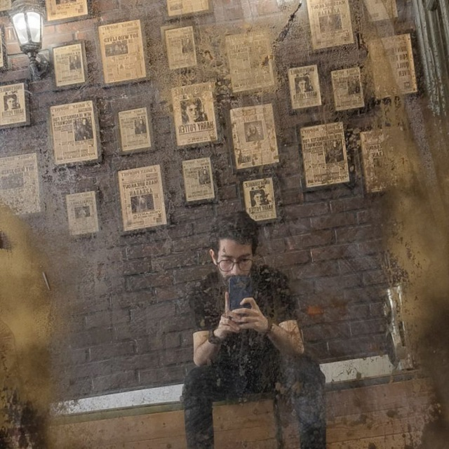

# معرفی

سلام! من **علی اسماعیلی** هستم، مهندس نرم‌افزار پایتون با بیش از پنج سال تجربه در حوزه کدنویسی و توسعه وب با استفاده از فریم‌ورک‌هایی مثل Django، Flask، FastAPI و غیره. در حال حاضر به عنوان **مهندس نرم‌افزار ارشد در Neurocage Systems LTD** فعالیت می‌کنم.

لینکدین من: [linkedin.com/in/realxoman](https://linkedin.com/in/realxoman)

## مهارت‌ها

- Python (زبان برنامه‌نویسی)
- Go
- Django
- کار با APIها و بهینه‌سازی پاسخ‌دهی آن‌ها
- مدیریت پروژه‌های نرم‌افزاری
- امنیت سیستم‌ها و تست نرم‌افزار

## تجربیات کاری

- **Neurocage Systems LTD** - **مهندس نرم‌افزار ارشد**  
  خرداد ۱۴۰۳ تا کنون (فعالیت به صورت دورکار)

- **Mizfa Tools** - **مشاور فنی**  
  خرداد ۱۴۰۲ تا کنون (فعالیت به صورت دورکار)  
  **مهندس نرم‌افزار پایتون**  
  خرداد ۱۴۰۰ تا اردیبهشت ۱۴۰۲ (۲ سال)  
  بهینه‌سازی عملکرد سیستم‌ها و توسعه ابزارهای نرم‌افزاری برای استارتاپ میزفا تولز

- **Mizfa Group** - **توسعه‌دهنده پایتون و طراح وب**  
  اردیبهشت ۱۳۹۶ تا خرداد ۱۴۰۱  
  طراحی و توسعه وب‌سایت‌ها و تولید محتواهای آموزشی در حوزه توسعه وب و سئو

## تحصیلات

- **دانشگاه آزاد اسلامی - قزوین**: کارشناسی ارشد، هوش مصنوعی  
  شهریور ۱۴۰۱ - شهریور ۱۴۰۳

- **دانشگاه آزاد اسلامی - کرج**: کارشناسی مهندسی کامپیوتر  
  دی ۱۳۹۶ - دی ۱۴۰۰

## زبان‌ها

- فارسی (مادری)
- انگلیسی (تسلط حرفه‌ای)

## گواهینامه‌ها

- دوره تخصصی توسعه فرانت‌اند
- طراحی وب برای همه: اصول توسعه وب
- کار با سیستم‌عامل با استفاده از پایتون

## افتخارات

- جایزه بهترین طراح فرانت‌اند - Webelopers دانشگاه شریف، ۲۰۲۱

## تماس

برای اطلاعات بیشتر یا همکاری می‌توانید با من از طریق ایمیل زیر در تماس باشید:  [**hi@aliesm.com**](mailto://hi@aliesm.com)