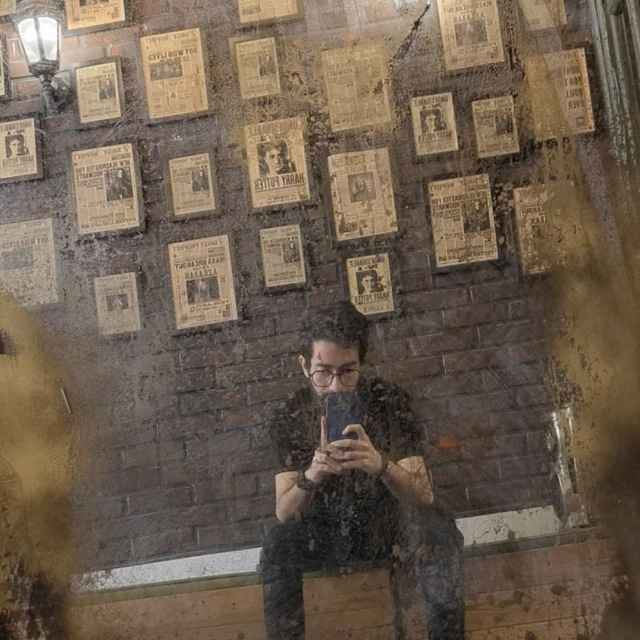

### Introduction

Hello! I'm **Ali Esmaeili**, a Python Software Engineer with over five years of experience in coding and web development using frameworks like Django, Flask, FastAPI, and more. Currently, I am working as a **Senior Software Engineer at Neurocage Systems LTD**.

**LinkedIn**: [linkedin.com/in/realxoman](https://linkedin.com/in/realxoman)  

---

### Skills

- Python (Programming Language)
- Go
- Django
- API Integration and Optimization
- Software Project Management
- System Security and Software Testing

---

### Work Experience

- **Neurocage Systems LTD** - **Senior Software Engineer**  
  *June 2024 – Present (Remote)*

- **Mizfa Tools**  
  - **Technical Consultant**: *June 2023 – Present (Remote)*  
  - **Python Software Engineer**: *June 2021 – May 2023 (2 years)*  
    - Optimized system performance and developed software tools for Mizfa Tools startup.

- **Mizfa Group** - **Python Developer and Web Designer**  
  *May 2017 – June 2022*  
  - Designed and developed websites and created educational content in web development and SEO.

---

### Education

- **Islamic Azad University - Qazvin**: Master’s in Artificial Intelligence  
  *September 2022 – September 2024*

- **Islamic Azad University - Karaj**: Bachelor’s in Computer Engineering  
  *January 2018 – January 2022*

---

### Languages

- **Persian**: Native  
- **English**: Professional Fluency  

---

### Certifications

- Advanced Front-End Development  
- Web Design for Everyone: Fundamentals of Web Development  
- System Operations with Python  

---

### Achievements

- Best Front-End Designer Award - Webelopers, Sharif University, 2021  

---

### Contact

For more information or collaboration, feel free to reach out via email: [**hi@aliesm.com**](mailto:hi@aliesm.com)  